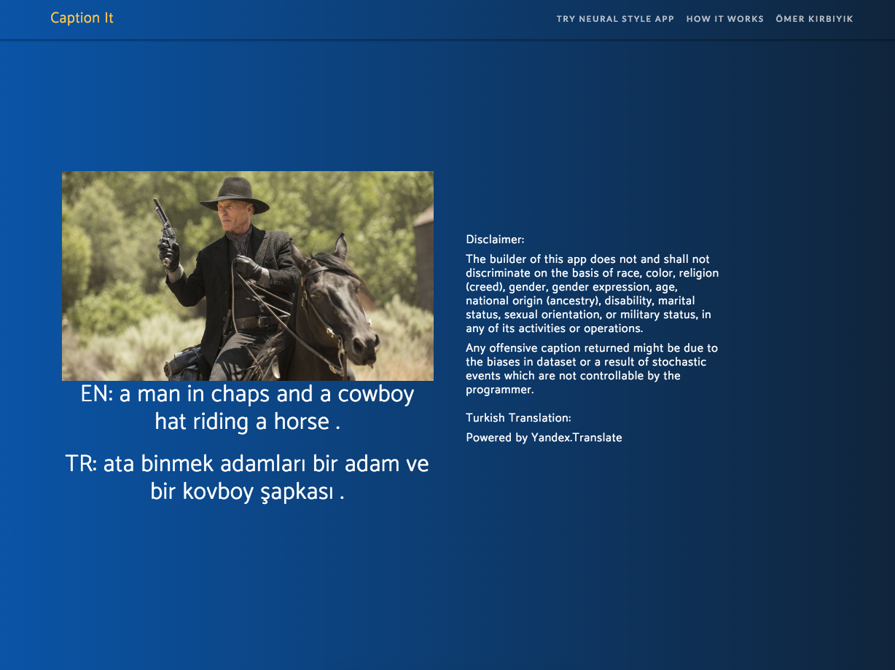

# caption-it

## Image Captioning Web Application

 

This project is the implementation of the paper [_Show and Tell: A Neural Image Caption Generator_](https://arxiv.org/abs/1411.4555)

Please visit below to see deployed web app.

http://omerkirbiyik.com/caption-it

Training
- Clone repository
- Download dataset with `src/download_dataset.sh`
- Preprocess with `src/build_vocab.py` and `src/resize.py`
- Train model giving appropriate arguments with `src/train.py`
  

Prediction
- Make a nginx configuration to run Flask app. This part can be tricky. [See this link for further.](https://www.digitalocean.com/community/tutorials/how-to-serve-flask-applications-with-uwsgi-and-nginx-on-ubuntu-16-04)

## References
- https://www.digitalocean.com/community/tutorials/how-to-install-nginx-on-ubuntu-16-04
- https://github.com/yunjey/pytorch-tutorial/tree/master/tutorials/03-advanced/image_captioning
- http://flask.pocoo.org/docs/1.0/deploying/
- https://arxiv.org/pdf/1411.4555.pdf
